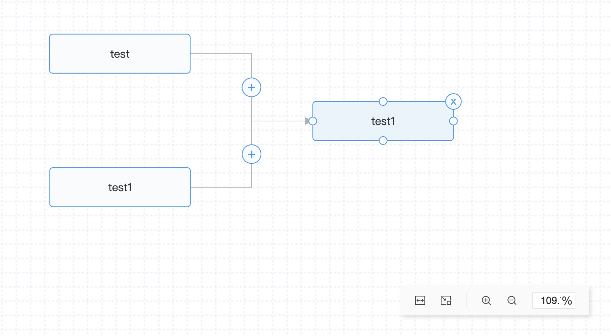

## 项目简介

`react data flow`是基于d3、svg、canvas实现数据流程图的react库，能传入节点值，绘制节点，可通过节点拖拽生成边，支持节点的拖拽，删除，能支持节点的键盘事件，如向上、向下、向左、向右移动，delete键删除节点及相关联的边。

支持react hooks的方式，绑定`useDFSelector`方法，将dfInstance的实例以属性的方式传入React Data Flow,便可通过实例化dfInstance暴露出的方法，实现获取当前图上的节点、边、偏移量的数据，也可通过`dfInstance.submit()`方法，触发onFinish事件，返回图上数据。

## 安装

```
npm install rdf-renderer
```
或
```
yarn add rdf-renderer
```


## 截图




## 实例
```javascript
import React from 'react';

import ReactDataFlow, { Backgrounds, Controls, useDFSelector } from '@/index';

const width = document.body.clientWidth;
const height = 600;
const nodes = [
  {
    id: 'id_001',
    title: 'test',
    position: { x: 185, y: 231 },
  },
  {
    id: 'id_002',
    title: 'test1',
    position: { x: 500, y: 231 },
  },
  {
    id: 'id_003',
    title: 'test1',
    position: { x: 185, y: 492 },
  },
];

const edges = [
  {
    endDirection: 'top',
    endPosition: { x: 185, y: 492 },
    id: 'id_001-id_003',
    sourceId: 'id_001',
    startDirection: 'bottom',
    startPosition: { x: 185, y: 231 },
    targetId: 'id_003',
    text: 10,
  },
  {
    endDirection: 'left',
    endPosition: { x: 498, y: 231 },
    id: 'id_001-id_002',
    sourceId: 'id_001',
    startDirection: 'right',
    startPosition: { x: 185, y: 231 },
    targetId: 'id_002',
  },
];

// 背景参数
/*const gridConfig = {
  strokeColor: '#ccc', // 边的颜色
  strokeWidth: 1, // 边的宽度
  isLineDash: false, // 是否虚线显示
};*/

const Demo = () => {
  const [dfInstance] = useDFSelector();

  return (
    <div
      style={{
        width,
        height,
        border: '1px solid #ccc',
      }}>
      <button onClick={() => console.log(dfInstance?.getDfValues())}>获取当前值</button>
      <button onClick={() => dfInstance?.setEdgeValues({ edgeId: 'id_001-id_002', text: 99 })}>
        设置边的值
      </button>
      <button onClick={() => dfInstance?.submit()}>提交</button>
      <ReactDataFlow
        flow={dfInstance}
        nodes={nodes}
        edges={edges}
        isShowCircle={true}
        onCircleCallback={(data) => console.log(data)}
        onFinish={(data: any) => console.log(data)}>
        <Backgrounds />
        <Controls />
      </ReactDataFlow>
    </div>
  );
};

export default Demo;

```

## 文档

名称 | 描述  |  类型  |  默认值  | 版本 |
--- | --- | --- | --- | --- |
nodes  |  节点信息(必填)  | Array<NodeTypes>  |  []  | 1.0.7
edges  |  边的信息(可选)  | Array<edgeTypes>  |  []  | 1.0.7
flow  |  传入rdf的实例，用于控制图上信息的设置和获取(可选)  | any |  -  | 1.0.7
isShowCircle  |  是否显示线上的圆(可选)  | boolean |  false  | 1.0.7
isCircleMove  |  选中节点时，起点到终点小球运动(可选)  | boolean |  false  | 1.0.7
onCircleCallback  |  线上圆的回调(可选)  | (edge) => void |  -  | 1.0.7
onFinish  |  完成后的回调，需要通过实例化，调用submit方法触发(可选)  | (data) => void |  -  | 1.0.7


### 节点选项

- id: string（必填）；
- position: { x: number, y: number }（必填）；
- title: string（必填）；
- 其他（待扩展）；


### 边的选项
- id: string（必填）；
- startPosition: { x: number, y: number }（开始节点坐标）(必填)
- endPosition: { x: number, y: number }（结束节点坐标）(必填)
- sourceId: string（开始节点id）(必填)
- targetId: string（结束节点id）(必填)
- startDirection: string（开始节点方向：top、bottom、left、right）(必填)
- endDirection: string（开始节点方向：top、bottom、left、right）(必填)
- text: string（线上文本）
- 其他（待扩展）

边可以不用传，React Data Flow会帮助生成，数据的交互内部即可实现，能通过onFinish或dfInstance.getDfValues()返回数据。


### dfInstance
名称  |  描述  |  类型  |  默认值  | 版本
| ---| --- | --- | --- | --- |
getDfValues  |  获取节点和边的信息  | () => DataFlowTypes |  {}  | 1.0.7
setEdgeValues  |  设置边上圆上的回显值  | (data: {edgeId: string, text: 99 }) => void |  {}  | 1.0.7
submit  |  提交信息，触发onFinish事件，返回数据  | () => void |  []  | 1.0.7


## 背景

引入方式
```javascript
import {Backgrounds} from 'rdf-renderer';

const gridConfig = {
  strokeColor: '#ccc', // 边的颜色
  strokeWidth: 1, // 边的宽度
  isLineDash: false, // 是否虚线显示
};

<ReactDataFlow flow={dfInstance} nodes={nodes} onFinish={onFinish}>
  <Backgrounds gridConfig={gridConfig} style={{ background: '#fff' }} />
</ReactDataFlow>
```

### 背景参数

名称  |  描述  |  类型  |  默认值  | 版本
| ---| --- | --- | --- | --- |
gridConfig  |  背景参数配置(可选)  | object |  {}  | 1.0.7
gridConfig.strokeColor  |  背景线条颜色  | string |  '#E2E2F0'  | 1.0.7
gridConfig.strokeWidth  |  背景线条宽度  | number |  1  | 1.0.7
gridConfig.distance  |  背景线条间距  | number |  20  | 1.0.7
gridConfig.isLineDash  |  是否虚线显示  | boolean |  true  | 1.0.7
gridConfig.lineDash  |  虚线的间距  | Array<[number, number]> |  [3, 3]  | 1.0.7
style |  支持原生标签的style样式  | - |  -  | 1.0.7


## 控件

引入方式
```javascript
import {Controls} from 'rdf-renderer';

// ...

<ReactDataFlow flow={dfInstance} nodes={nodes} onFinish={onFinish}>
  <Controls />
</ReactDataFlow>
```
控件目前是写死的，后期会根据选项是否支持特定功能。


## 说明
当前版本是根据公司需求完成符合指定需求的产品，后期会慢慢扩展，若有要求提issues。
